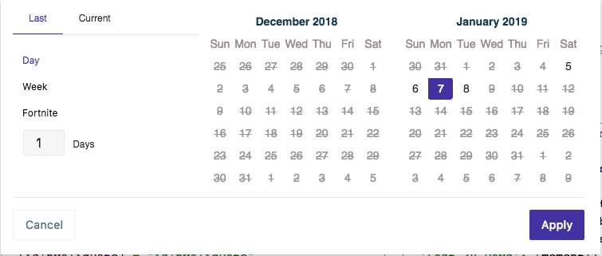

# ngx-material-daterangepicker
> Pure Angular 2+ Date range picker.

This plugin is compatible with Angular2, Angular4, Angular5 and Angular6. This plugin uses moment.js.

This plugin is a rewrite to angular from [bootstrap daterangepicker](http://www.daterangepicker.com), so it doesn't depends on jquery nor bootstrap.

This plugin have an independant theme which looks more close to material design, so the material design is just a style.



Credits: This is a fork of: https://github.com/fetrarij/ngx-daterangepicker-material

This fork contains multi level categories. Demo: https://aliarshad9691.github.io/ngx-material-daterangepicker/ 

## Installation

 Install the plugin from npm:
 
 `npm install ngx-material-daterangepicker --save` .

 import **NgxMdDaterangepicker** in your module:

````typescript
...
import { FormsModule } from '@angular/forms';
import { NgxMdDaterangepicker } from 'ngx-material-daterangepicker';
import { App } from './app';

@NgModule({
    imports:      [... , FormsModule, NgxMdDaterangepicker],
    declarations: [App],
    bootstrap:    [App]
})
export class AppModule {}
````

## Usage example

Html:

```html
<input type="text" ngxMdDaterangepicker [(ngModel)]="selected" class="form-control"/>
```
Typescript: 

````typescript
selected: {startDate: Moment, endDate: Moment};
````
### with some options: 
Html:

```html
<input type="text" matInput
    ngxMdDaterangepicker
    [locale]="{applyLabel: 'ok', format: 'DD-MM-YYYY'}"
    startKey="start"
    endKey="end"
    [(ngModel)]="selected"
    name="daterange"/>
```
Typescript: 

````typescript
selected: {start: Moment, end: Moment};
````
You can [play with our online demo here](https://aliarshad9691.github.io/ngx-material-daterangepicker/)
and [browse our demo code here](./demo/src/app).

## Inline usage

You can use the component directly in your templates, which will set its `inline` mode to **true**, in which case the calendar won't hide after date/range selection. You can then use the events: `rangeClicked` or `datesUpdated` or `choosedDate` to get its selection state.

```html
<ngx-material-daterangepicker (choosedDate)="choosedDate($event)">
</ngx-material-daterangepicker>
```


## Available options

### autoApply, showDropdowns, singleDatePicker, showWeekNumbers, showISOWeekNumbers, alwaysShowCalendars, showClearButton, showCancel

>These options are booleans

### isCustomDate

>(function) A function that is passed each date in the calendars before they are displayed, and may return a string or array of CSS class names to apply to that date's calendar cell

### isInvalidDate
>(function) A function that is passed each date in the two calendars before they are displayed, and may return true or false to indicate whether that date should be available for selection or not.

### minDate, maxDate

 >To set the minimal and maximal date, these options are a moment date

### locale

>the locale options is an object with: 
```javascript
{
    format: 'MM/DD/YYYY',
    separator: ' To ', // default is ' - '
    cancelLabel: 'Cancel', // detault is 'Cancel'
    applyLabel: 'Okay' // detault is 'Apply'
    firstDay: 1 // first day is monday
}
```
### startKey and endKey

Theses 2 options are for the key you want for the value, default are `startDate` and `endDate`, it means the value we have from ngModel are: `{startDate: Date, endDate: Date}` by default;

Specifiyng `startKey` and `endKey` would have different model:

example: 
```html
<input type="text" ngxMdDaterangepicker startKey="start" endKey="end" [(ngModel)]="model">
```

the model we got would be:  `{start: Date, end: Date}`

### ranges

(object) Set predefined date ranges the user can select from. Each key is the label for the range, and its value an array with two dates representing the bounds of the range. As an example:
```html
<input type="text" ngxMdDaterangepicker startKey="start" endKey="end" [ranges]="ranges" [(ngModel)]="model">
```
```javascript
ranges: any = {
    'Today': [moment(), moment()],
    'Yesterday': [moment().subtract(1, 'days'), moment().subtract(1, 'days')],
    'Last 7 Days': [moment().subtract(6, 'days'), moment()],
    'Last 30 Days': [moment().subtract(29, 'days'), moment()],
    'This Month': [moment().startOf('month'), moment().endOf('month')],
    'Last Month': [moment().subtract(1, 'month').startOf('month'), moment().subtract(1, 'month').endOf('month')]
  }
```
#### Other options with ranges

You can use bellow options when using the ranges. The default are `false`.

| Attribut | Type |Description |
| --- | --- |--- |
| alwaysShowCalendars | boolean | set to `true` if you want to display the ranges with the calendar |
| keepCalendarOpeningWithRange | boolean | set to `true` if you want the calendar won't be closed after choosing a range |
| showRangeLabelOnInput | boolean | set to `true` if you want do display the range label on input |

### Timepicker

You have to set the attribute `timePicker` to `true` if you want to enable the timepicker.

You can use theses options:

| Attribut | Type |Description |
| --- | --- |--- |
| timePicker24Hour | boolean | set to `true` if you want to set the timepicker to 24h instead of having AM and PM |
| timePickerIncrement | number | set the value increment of the minutes (eg: for `12` there would be 0mn, 15mn, 30mn, 45mn,) |
| timePickerSeconds | boolean | set `true` if you want do display second's select |


### Customisation

| Attribut | Type |Description |
| --- | --- |--- |
| firstMonthDayClass | string | add a custom class for all first day of the month |
| lastMonthDayClass | string | add a custom class for all last day of the month |
| emptyWeekRowClass | string | add a custom class for all date in a week not in the current month |
| lastDayOfPreviousMonthClass | string | add a custom class for the last day of the previous month |
| firstDayOfNextMonthClass | string | add a custom class for the first day of the next month |

### Positioning

| Attribut | Possible values |Description |
| --- | --- |--- |
| opens | left, center, right | position the calendar from the input element |
| drops | up, down | position the calendar to the up or down of the calendar |

## Available events

### \(rangeClicked)

 >Fired when clicked on range, and send an object with range label and dates value, eg:  `{label: 'This Month', dates: [Moment, Moment]}`

### \(datesUpdated)

 >Fires when the date model is updated, like applying (if you have activated the apply button), or when selecting a range or date without the apply button, and sends an object containing start and end dates, eg: `{startDate: Moment, endDate: Moment}`


## [License](https://github.com/aliarshad9691/ngx-material-daterangepicker/blob/master/LICENSE)
MIT
